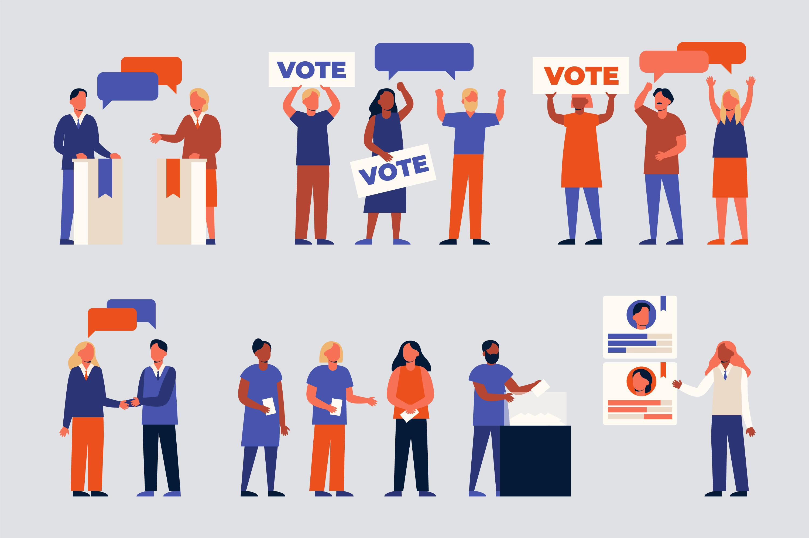

# **Final Project Showcase**

For our Artificial Intelligence (CIF63110) Final Project, we needed to create either regression/classification/clustering project with machine learning model and statistical concept we learned in the class. We and our team decided to explored Naive Bayes algorithm in classify election topic classification. We also want to explored an Optuna based approach for hyper parameter and SMOTE resampling to handle multiclass problem. We concluded the experiment using Complement Naive Bayes, an version of Naive Bayes that able to hndle imbalanced dataset more than the usual Naive Bayes text classification model like Multinomial Naive Bayes.

Our solution are:
"**Optimizing Complement Naive Bayes for Imbalanced Multiclass Election Tweet Classification Using a Balanced Class Approach with Optuna**"

## Dataset

We used Satria Data 2024 Big Data Challenge Qualification datasets, the dataset consist of 5000 tweet that classified in eight topic of ASTAGATRA (Politik, Ideologi, Sosial Budaya, Ekonomi, Pertahanan & Keamanan, Geografi, Demografi, Sumber Daya Alam).

## Our Team

- Pieter Christy Yan Yudhistira (TIF'23)
- Joshua Dwiputra Rendro Joelaskoro (TIF'23)
- Christopher Robin Tanugroho (TIF'23)
- Vannya Ade Gunawan (TIF'23)
